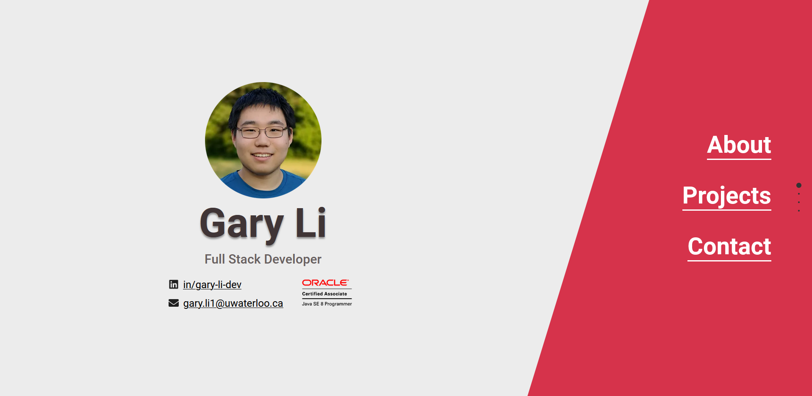

# garyli.dev
Personal site built with Next.js and MUI with automatic deployments.

## Description
This repo contains the source code for my personal site. Some notable features include:
* Images are automatically optimized with Next.js's Image components, which serve latest gen image formats (webp) based on compatibility.
* Next.js bundle analyzer support, which is enabled when the env var `ANALYZE` is true.
* Dependencies are monitored and kept up to date via Github's dependabot, and all commits are automatically deployed to Vercel.

## Preview

## License
[GPL](https://choosealicense.com/licenses/gpl-3.0/)
